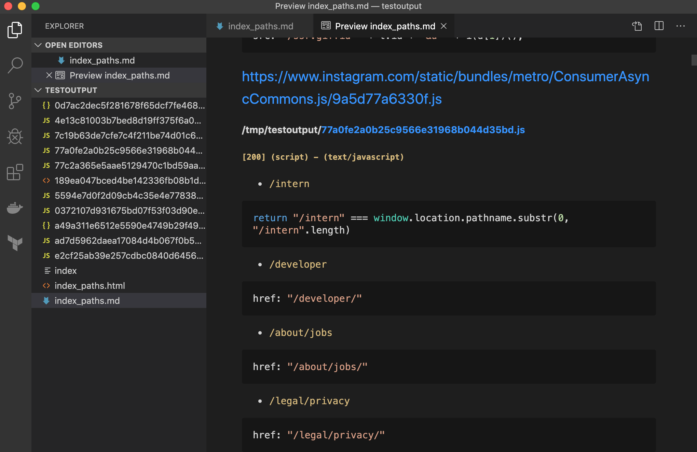

# jsfinder
Find paths or stuff in URL's JS files and XHR requests


## Install 

```
$ git clone https://github.com/suskind/jsfinder.git

$ cd jsfinder

$ npm install 

$ ln -s `pwd`/bin/jsfinder /usr/local/bin/jsfinder

$ jsfinder -h
```

## Options

```
Commands:
  jsfinder jsfinder  Parse JS files for paths and stuff. ex:
                     $ jsfinder -u https//example.com -o /tmp/out --insource

Options:
  --version       Show version number                                  [boolean]
  --url, -u       URL to be parsed. ex: -u https://example.com          [string]
  --output, -o    Output dir. ex: -o /tmp/out                           [string]
  --header, -H    Header                                                 [array]
  --regexp, -r    RegExp to Match (default: relative paths)
                  ex: --insource -r '(secret|pass).*'                   [string]
  --logsufix, -s  Log file sufix name.
                  ex: "-o /tmp/out -r pass -s secret" will create
                  /tmp/out/index_secret.md                              [string]
  --browser       Open chromium browser                                [boolean]
  --ads           Allow blacklisted ads related URLs                   [boolean]
  --insource      Search for paths in source                           [boolean]
  --nocache       Ignore previous cached requests                      [boolean]
  --mobile, -m    Emulate Mobile phone (iPhone X)                       [string]
  --vscode        Open output dir with VSCode.
                  ex: "-o /tmp/out --vscode" will exec "code /tmp/out" [boolean]
  --noscroll      Force to don't do autoscroll                         [boolean]
  --help, -h      Show help                                            [boolean]
  ```

Examples:

* Load URL, JS and XHR assets

```
$ jsfinder -u https://example.com
```

* Load URL, JS and XHR assets, save them to `/tmp/out` and search for paths

```
$ jsfinder -u https://example.com -o /tmp/out --insource
```

* Load stuff ignoring cached files (requests are cached in `/tmp/jsfindercache` directory)

```
$ jsfinder -u https://example.com -o /tmp/out --insource --nocache 
```

* Load and search "in sources" for the given regexp

```
$ jsfinder -u https://example.com -o /tmp/out --insource --nocache -r '(secret|pass).*' -s 'log_sufix'
```


## Output

```
$ jsfinder -u 'https://instagram.com' -o /tmp/testoutput  --insource  --vscode --nocache 
No cache... will open URL....
document :: (200) text/html :: https://www.instagram.com/
script :: (200) text/javascript :: https://www.instagram.com/static/bundles/metro/Vendor.js/5a56d51ae30f.js
script :: (200) text/javascript :: https://www.instagram.com/static/bundles/metro/en_US.js/5ff6b8bc5f4a.js
script :: (200) text/javascript :: https://www.instagram.com/static/bundles/metro/ConsumerUICommons.js/7dbba70e0d07.js
script :: (200) text/javascript :: https://www.instagram.com/static/bundles/metro/ConsumerAsyncCommons.js/9a5d77a6330f.js
script :: (200) text/javascript :: https://www.instagram.com/static/bundles/metro/ConsumerLibCommons.js/613cb842a4b0.js
script :: (200) text/javascript :: https://www.instagram.com/static/bundles/metro/Consumer.js/f09a59b0a2dc.js
script :: (200) text/javascript :: https://www.instagram.com/static/bundles/metro/LandingPage.js/1b1f5d68432a.js
script :: (200) text/javascript :: https://www.instagram.com/static/bundles/metro/Polyfills.js/676f710a990a.js
xhr :: (200) application/json :: https://www.instagram.com/qp/batch_fetch_web/
xhr :: (200) application/json :: https://www.instagram.com/ajax/bz
Writing cache file...
Got 11 files...
Beautifying resources...
 ████████████████████████████████████████ 100% | ETA: 0s | 11/11
Done.

```

